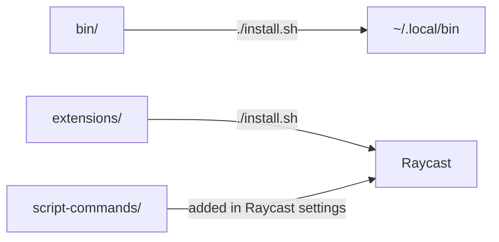

# raycast-tools

Raycast extensions and small scripts for working with many git worktrees and
Claude Code sessions at once. Take what you want.

| | What it does | Install |
|---|---|---|
| **[Worktrees](extensions/worktrees)** | Every worktree of every repository you have, one keystroke from VS Code, a terminal or its pull request | `./install.sh worktrees` |
| **[My Commands](extensions/my-commands)** | All the Raycast script commands, extensions and shell scripts you made yourself, in one searchable list | `./install.sh my-commands` |
| **[Claude Panes & Claude Sessions](script-commands)** | Open a grid of Claude sessions for a project, or see which ones are running | [add a folder in Raycast](#raycast-script-commands) |
| **[cl, claude-sessions, iterm-run](bin)** | The same from the terminal, plus opening an iTerm tab anywhere | `./install.sh cl` |

## Install

```bash
git clone https://github.com/rodlandA/raycast-tools ~/Dev/raycast-tools
cd ~/Dev/raycast-tools

./install.sh --list       # what there is
./install.sh worktrees    # what you want — or everything, with no names
```

Each part ends up in one of three places:



To update, `git pull` and run `./install.sh` again with the same names.
`./install.sh --help` covers the rest.

### Raycast script commands

Raycast reads these straight from the folder, so there is nothing to install. In
Raycast → Settings → Extensions → Script Commands, choose **Add Directories**
and pick `~/Dev/raycast-tools/script-commands`.

### Requirements

macOS and Raycast. The extensions need Node and npm; `cl` and `iterm-run` need
iTerm2. Scripts go in `~/.local/bin`, which has to be on your `PATH`.

Some parts are better together: **Run Script** in Worktrees needs `iterm-run`,
and **Open Claude Panes** needs `cl`.

## Adding something

- **Script:** an executable file in `bin/`. Its first comment line is what
  `--list` shows.
- **Extension:** a Raycast extension in `extensions/<name>/`.
- **Script command:** a file in `script-commands/`. Call a script in `bin/`
  relative to the command's own path, as the existing ones do.

## License

[MIT](LICENSE)
