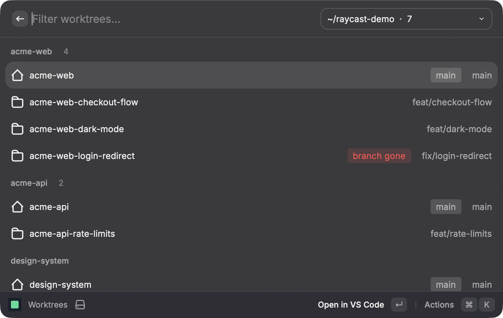
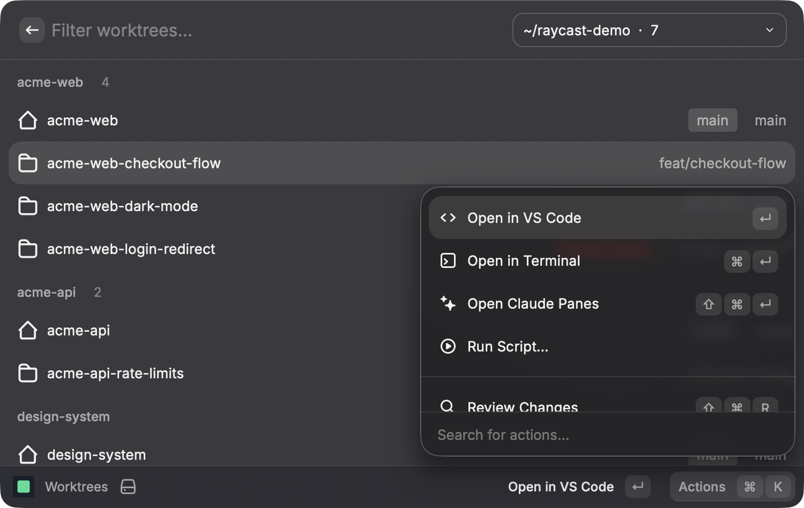
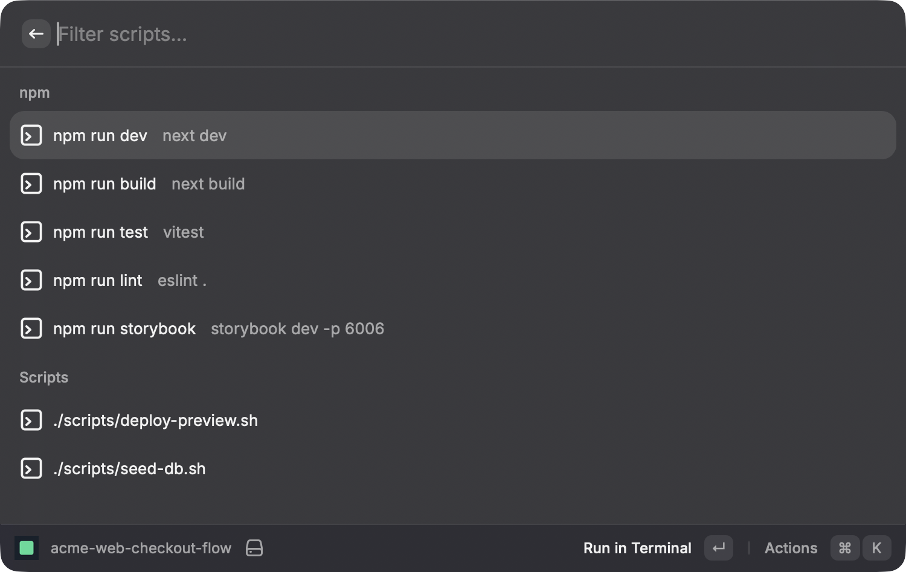

# Worktrees

Every git worktree of every repository you have, grouped by repository and one
keystroke away from VS Code, a terminal or its pull request. Useful when several
agents or branches are in flight at once, each in its own checkout.

```bash
./install.sh worktrees             # from the repository root
./install.sh worktrees iterm-run   # plus what Run Script needs
```



There is nothing to set up. It finds the folders under your home that hold git
repositories and offers them in a dropdown in the search bar; the one you pick is
remembered. Code outside your home folder goes under **Extra Roots** in the
preferences.

## Commands

**Worktrees** — open, create and remove worktrees. A red `branch gone` tag marks
one whose branch was deleted upstream, which is what a merged branch looks like.

| Action | Shortcut |
|--------|----------|
| Open in VS Code | ⏎ |
| Open in Terminal | ⌘⏎ |
| Open Claude Panes | ⌘⇧⏎ |
| Run Script… | |
| Review Changes | ⌘⇧R |
| Open Pull Request | ⌘O |
| Copy Path | ⌘⇧C |
| New Worktree | ⌘N — created next to the main checkout as `<repo>-<slug>` |
| Remove Worktree | ⌃X — asks first |



**Run Script** — the same list, but running one of the worktree's npm or shell
scripts is the main action.



**Pull Requests** — pick a repository to see its open pull requests, each tagged
`passing`, `failing` or `running` from its checks.

**Phone QR** — QR codes for opening a worktree's running dev server on a phone.
Only shown for repositories that provide a `scripts/phone-qr.sh`.

## What the actions need

| Action | Needs | Without it |
|--------|-------|------------|
| Open Claude Panes | [`cl`](../../bin/README.md#cl) | hidden |
| Review Changes | a `git-review` script of your own — not included | hidden |
| Run Script | [`iterm-run`](../../bin/README.md#iterm-run) | says it is missing |
| Open in Terminal | [`iterm-run`](../../bin/README.md#iterm-run) | opens Terminal.app instead of iTerm |
| Open in VS Code | the `code` command | shows an error |
| Open Pull Request, Pull Requests | [`gh`](https://cli.github.com), logged in | shows an error |

## Developing

`npm run dev` hot-reloads into Raycast and shows errors there.

Raycast starts an extension with a minimal `PATH`, so `src/lib/exec.ts` sets one
that covers `/opt/homebrew/bin`, `/usr/local/bin` and `~/.local/bin` — without
it `git`, `gh` and `code` are not found. Phone QR writes its images to
`~/Library/Caches/worktrees-phone-qr/`, because Raycast markdown ignores
`file://` images.
